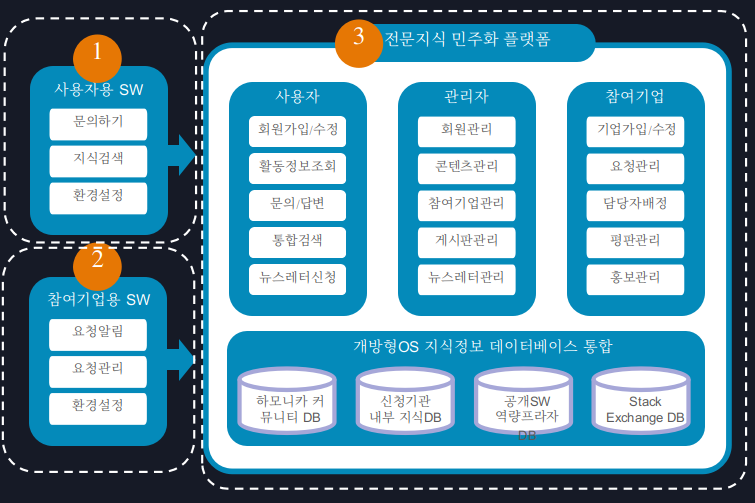

# __개방형OS 사용자 중심의 전문지식 민주화 플랫폼(Democratization of Expertise)__

# **목차**
* [프로젝트 소개](#프로젝트-소개)
* [소스코드 저장소](#소스코드-저장소)
* [프로젝트 개발의 필요성](#프로젝트-개발의-필요성)
* [프로젝트 기술 범위](#프로젝트-기술-범위)
* [사용 방법](#사용-방법)
* [참여 방법](#참여-방법)
* [라이센스](#라이센스)

# **프로젝트 소개**
개방형OS 사용자 중심의 전문지식 민주화 플랫폼이란 추가적인 값비싼 훈련을 요구하지 않으면서도 극히 단순화된 경험을 통해 사람들에게 전문 지식을 제공하는 것에 초점이 맞춰져 있는 서비스 입니다.  
사용자들은 여기저기 흩어져 있는 개방형OS 정보들을 지식검색을 통해 쉽게 통합검색 할 수 있으며
사용자와 기술지원 기업 사이에 복잡한 절차 없는 기술지원을 목표로 하며 누구나 개방형OS를 쉽게
사용 할 수 있게 지원하여 하나의 OS에 종속되지 않는 건강한 생태계 조성을 목표로 합니다.


개방형OS 사용자 중심의 전문지식 민주화 플랫폼은 처음부터 끝까지 참여자들과 소통하여 진행하며 이 프로젝트가 올바른 방향으로 진행될수 있게 참여자들과 함께 만들어 갑니다.


개방형OS 사용자 중심의 전문지식 민주화 플랫폼은 크게 사용자용 지원 프로그램 , 사용자 지원 커뮤니티, 참여기업용 프로그램으로 구성되어 있습니다.


# **소스코드 저장소**
사용자 지원 커뮤니티 : https://github.com/hamonikr/democratization-expertise  
클라우드 원문 검색 : https://github.com/hamonikr/hamonikr-finder

# **프로젝트 개발의 필요성**
- 개방형OS 확산의 핵심은 잘 운영되는 공개SW 커뮤니티 기반의 문제 해결
- 전문 지식이 없는 개방형OS 사용자 중심의 전문지식 민주화 플랫폼 필요
- 사용자 참여에 의한 유기적 콘텐츠의 수준 관리가 필수
- 커뮤니티 참여자의 몰입도 향상을 위한 게이피케이션(Gamification)적용
- 커뮤니티의 기여자가 유,무형의 보상을 획득할 수 있는 거버넌스 필요
- 공개SW 커뮤니티는 지속적 관리를 통한 신뢰 구축이 핵심

# **프로젝트 기술 범위**

1. **개방형OS 사용자용 지원 SW**
- 전문지식이 없는 개방형OS 사용자도 빠른 답변을 받을 수 있도록, 질문과 동시에 현재 사용중인 PC의 충돌 기록, 사용자로그, 시스템 정보 등의 데이터를 자동으로 전송할 수 있는 프로그램.

2. **개방형OS 참여기업용 SW**

- 자신이 관심 있는 주제나 지역을 설정해 두면 커뮤니티의 새 글이 등록되는 순간 알림을 보내주고, 자신에게 요청한 개방형OS 사용자의 요청사항을 관리할 수 있는 프로그램.

3. **개방형OS 사용자 중심의 전문지식 민주화 플랫폼**

- 유기적 컨텐츠 관리를 위한 Voting, 컨텐츠 Tagging, 기존 컨텐츠와 관련성을 유지하는 편집구조, 게이미피케이션을 적용한 Badges, 실력에 기반한 평판 시스템 Karma 등의 기능이 제공되어  개방형OS 사용자와 개방형OS 기술지원기업이 공생할 수 있는 공개SW 커뮤니티.
  - **지식검색**  
  컨텐츠 통합 검색을 위해 hwp, pptx, docx, pdf 등 1400여개 콘텐츠 유형에 대한 원문검색을 제공하는 클라우드 검색엔진을 이용 (2019년 기 개발 검색엔진 컨테이너 https://github.com/hamonikr/hamonikr-office-toolchain)
  - **Pre Search**  
  질문자가 사전에 자신의 원하는 질문이 있었는지 또는 관련된 정보가 존재하는지 먼저 검토할 수 있도록 질의하는 입력란에 키워드를 입력하는 순간 실시간 검색결과를 아래 제공하여 중복되는 질문을 최소화 하는 기능
  - **Voting**  
  커뮤니티 구성원에 의해서 컨텐츠가 유기적으로 관리될 수 있는 Voting 기능. 이 기능을 이용하여 사용자의 평가에 의해 해당 콘텐츠의 노출 순위가 변경되고 가치 없는 질문은 커뮤니티에 의해 스스로 관리될 수 있음. 
  - **콘텐츠 편집기능**  
  커뮤니티 구성원 누구나 모든 콘텐츠에 대해서 편집할 수 있는 기능. 이전에 작성된 질문이나 답변을 다른 사용자가 편집할 수 있는 권한을 가지며, 마크업 문법에 익숙하지 않는 사용자를 위해 위지윅 편집기를 제공하여 양질의 콘텐츠가 계속 발전할 수 있게 된다.
  - **Tagging**  
  질문을 분류하는 키워드 또는 레이블을 이용하여 콘텐츠를 분류하는 기능. 올바른 태그를 사용하는 문화가 정착되면 다른 커뮤니티 사용자가 원하는 질문을 쉽게 찾을 수 있고 답변할 수 있음. 태그를 관리하기 위한 동의어 관계를 구성하는 기능을 제공하여 주제에 적합한 태그로 식별될 수 있는 기능 제공
  - **Gamification**  
  질문과 답변으로 명성을 얻는 것 뿐만 아니라 특별한 행동에 대해 배지를 부여. 이 심볼은 커뮤니티 사용자의 프로필 페이지와 관련 스킬 페이지, 그리고 게시물에 표시되어 커뮤니티 참여를 독려하게 됨
  - **Reputation**  
  투명한 사실 데이터에 기반한 평판 시스템을 적용하여 사용자의 활동 내역을 누구나 열람할 수 있게 공개하고, 사용자가 활동한 내역을 근거로 명성을 확보할 수 있게 하여 적극적인 활발한 참여자가 명성을 획득할 수 있는 기능. 향후 e-포트폴리오가 되어 공개SW 전문인력 수급의 기초자료로 사용될 수 있음

  # **사용 방법**
 1. **개방형OS 사용자 중심의 전문지식 민주화 플랫폼**
  ``````
  #저장소 복제
  git clone https://github.com/hamonikr/democratization-expertise.git
  #저장소로 이동
  cd democratization-expertise
  #하위의 de-community 폴더에서 작업
  ``````
  2. **개방형OS 사용자용 지원 SW**
  ``````
  #저장소 복제
  git clone https://github.com/hamonikr/democratization-expertise.git
  #저장소로 이동
  cd democratization-expertise
  #하위의 de-user-sw 폴더에서 작업
  ``````
  3. **개방형OS 참여기업용 SW**
  ``````
  #저장소 복제
  git clone https://github.com/hamonikr/democratization-expertise.git
  #저장소로 이동
  cd democratization-expertise
  #하위의 de-business-sw 폴더에서 작업
  ``````

  # **컨트리뷰션 참여 방법**
  [참여방법](CONTRIBUTING.md)

  # **라이센스**
  [라이센스](LICENSE)
